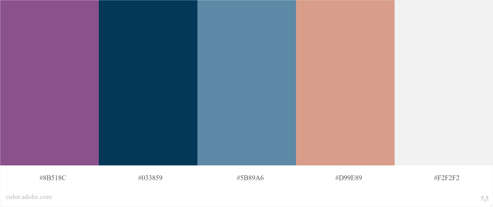

# **P&L Services Website** 

[View website on GitHub Pages](https://andrewboyd79.github.io/P-L-Services/)

This P&L services website has been produced by Andrew Boyd as a Milestone 1 Project for the Code Instutute's Full Stack Web Development course.

Pathology and laboratory (P&L) services are provided in hospitals across the globe and play a vital role in the diagnosis and monitoring of disease. Each of these hospital labs spend considerable time and effort producing vast amounts of information/content for their end users; however, all to often, it doesn't reach them as they don't have the time to search and scour poorly designed websites for it. 

The purpose of this website is to make that information accessible to the labs end user quickly and clearly.  It has been designed to set out the information logically and with clear navigation aids to ensure the user can move through the website efficiently.

The website features at a glance information on any issues currently affecting laboratory services, up to date information on test and sample requirements, showcasing work of laboratory departments using video tours/galleries and a contact us page.

---

## **Contents**
1. **[UX](#ux)**
    - [Business Goals](#Business-Goals)
    - [Target Audience](#Target-Audience)
    - [User Goals](#User-Goals)
    - [User Stories](#User-Stories)
    - [User Considerations](#User-considerations)
    - [Wireframe diagrams](#Wireframe-diagrams)
        - [Home Page](#Home-page)
        - [Gallery Page](#Gallery-page)
        - [Contact Us Page](#Contact-Us-page)

    - [Design Considerations](#Design-considerations)
        - [Colours](#Colours)
        - [Fonts](#Fonts)
        - [Icons](#Icons)

2. **[Features](#Features)**
    - [Initial Release Features](#Initial-release-features)
        - [Global Features](#Global-features)
        - [Home Page Features](#Home-page-features)
        - [Gallery Page Features](#Gallery-page-features)
        - [Contact Us Page Features](#Contact-Us-page-features)

    - [Features for future releases](#Features-for-future-releases)

3. **[Technologies Used](#Technologies-used)**
    - [Languages](#Languages)
    - [Libraries](#Libraries)

4. **[Testing](#Testing)**

5. **[Deployment](#Deployment)**

6. **[Credits](#Credits)**
    - [Images](#Images)
    - [Content](#Content)
    - [Code](#Code)
    - [Acknowledgements](#Acknowledgements)
---

# **UX**
User Experience, and associated UX design, is concerned with how a user interacts with something; throughout this project consideration has been given to each of the 5 planes of UX.

## Business Goals
The business expects this website to:
- Provide up to date, accurate information to end users of P&L Services
- Increase awareness of pathology and laboratory functions and services
- Showcase the work of each laboratory department/section
- Provide an alternative means to contact P&L Services - to reduce reliance on telephone calls
- Develop an online ordering system for laboratory stores

## Target audience
The target audience of this website is:
-   Users of pathology laboratory services: 
    - Doctors
    - Nurses
    - Phlebotomists
    - Associated healthcare professionals (secretaries/receptionists)
    - Laboratory staff
    - Other interested hospital staff members 
    - The general public (to a lesser extent)
    
Users will be expecting information presentation to be:
- Accurate
- Clear
- Concise
- Intuitive

Users will be comfortable with the following types of content:
- Tables
- Graphical forms
- Imagery - including medical images
- Videos

## User Goals
Users of this website expect to be able to:
- Be made aware of issues which might delay laboratory results
- Acccess information provided by/about the laboratory quickly and efficiently
- Reduce the amount of time spent on phone to labs for simple queries
- Reduce the amount of time spent waiting to speak to correct person within the lab i.e. on hold / being transferred
- Speak to most appropriate member of staff to resolve queries/issues
- Find out more about the role of the laboratory

## User Stories
The following user stories have been developed to outline some of the benefits the website has to its users:

1. As a user I want to find out which sample bottle/type I require so that I can sample my patient correctly

2. As a user I want to be able to tell why my patients blood results are taking longer than normnal so I can discharge patients as quickly as possible

3. As a user I want to have the most suitable staff member contact me about a laboratory result so that I can treat my patient properly

4. As a user I want to find out what goes on behind those closed doors in the laboratory so I have confidence in the work they're doing

5. As a business manager I want end users not to be calling asking about sample bottles/test so laboratory staff can concentrate on testing

6. As a business manager I want to showcase the laboratory in the best light so that I can get additional funding

7. As an organisation I want to highlight the achievements of our laboratory and staff so I can demonstrate excellence of service

## User considerations
Consideration has been given to the following when developing website which meets the needs of both the business and the users:
- Many laboratories already have some online presence on organisational intranets or the internet; however, their poor styling and lack of consideration for the User Experience (UX) has meant they are not fit for purpose
- Laboratory printed handbooks have been primarily replaced by the same documents in .pdf format which the user must sownload and search for the relavant information.  On some competitor websites this is the only means of accessing this information.
- Nurses/doctors often struggle to find a free PC terminal to access laboratory information at the time when they need it most, i.e. when preparing to collect blood samples at the patient bedside. This lead to a mobile first/responsive web design which will set this website apart from its competition.
- To prevent mistakes, and comply with regulatory requirements, labs must ensure that information which they provide is up to date; therefore availability of old and potentially inaccurate information eg. old .pdf versions

## Wireframe diagrams

### Home Page

 - [Mobile view](documentation/wireframes/HomePageMobileView.png)
 - [Tablet view](documentation/wireframes/HomePageTabletView.png)
 - [Desktop view](documentation/wireframes/HomePageDesktopView.png) 

### Gallery Page

 - [Mobile view](documentation/wireframes/GalleryPageMobileView.png)
 - [Tablet view](documentation/wireframes/GalleryPageTabletView.png)
 - [Desktop view](documentation/wireframes/GalleryPageDesktopView.png)

### Contact Us Page

 - [Mobile view](documentation/wireframes/ContactUsPageMobileView.png)
 - [Tablet view](documentation/wireframes/ContactUsPageTabletView.png)
 - [Desktop view](documentation/wireframes/ContactUsPageDesktopView.png) 

## Design Considerations

### Colours
 

These have been selected to complement the purple colour of haematology blood collection bottle.  
 - Purple (#8B518C)
 - Dark Blue (#033859)
 - Teal (#5B89A6)
 - Orange (#D99E89)
 - Off White (#F2F2F2)
 - Dark Gray (#545454)

The combination has been checked on Adobe Colour; no potential conflicts have been found and the swatches are colour blind safe.

### Fonts

- The sans serif font Exo 2 has been chosen for the headings as it has a futuristic/technological feel which is in keeping with P&L Services branding.  It is available on Google fonts and if it fails will be replaced with a sans serif font within the browser.

-  The sans serif font Open Sans has been chosen for the body text as it compliments Exo 2; it also has excellent legibility having been optimised for both web and mobile interfaces.  It is available on Google fonts and if it fails will be replaced with a sans serif font within the browser.

### Icons
The following Font Awesome icons from medical and science categories will be used throughout this website:
- Bacteria (https://fontawesome.com/icons/bacteria?style=solid)
- Facebook (https://fontawesome.com/icons/facebook?style=brands)
- Flask (https://fontawesome.com/icons/flask?style=solid)
- Hospital (https://fontawesome.com/icons/hospital-symbol?style=solid)
- Microscope (https://fontawesome.com/icons/microscope?style=solid)
- Phone (https://fontawesome.com/icons/phone?style=solid)
- Photo (https://fontawesome.com/icons/phone?style=solid)
- Twitter (https://fontawesome.com/icons/twitter?style=brands)
- Vial (https://fontawesome.com/icons/vial?style=solid)
- Youtube (https://fontawesome.com/icons/youtube?style=brands)

---

# **Features**
The website will initially be developed as a Minimal Viable Product (MVP) and developed from there with new features being added as time/developer skills allow.

## Initial release features
Based on importance/feasability analysis the following features will be available in the initial release:

- Look up section which provides information on the most common lab tests/profiles, outlines which sample types are suitable, which bottles/containers should be used and what the normal time to result availability should be
- Gallery page with images of each laboratory department showcasing it's work 
- Contact us page with a form on which the user can specify which department they wish to contact, what they would like to discuss, how they should be contacted and what the urgency of the enquiry
- The site should have clear navigation section to guide the user and should link to any relevant external websites/social media links of the organisation

## Global Features
The following features will persist across all website pages to provide a consitent look and feel:
 - Header section
    - Logo - the logo (.png file) will be located in the top left portion of the header and will provide consistent branding.  Clicking on the logo returns the user to the home page.
    - Navbar - the items in the navigation bar will be located on the right hand side of the header and will provide a means of moving between pages. On a mobile device the items will form a dropdown menu.  Clicking each name will link the user to the relevant page.
    - The header will act size responsively and on mobile sized devices will collapse to a menu bar with the links being displayed vertically when selected.

- Footer Section
    - Social Media Links - these icons will be positioned to the left hand side of the footer.  Clicking each will open a new tab and take the user to the appropriate social media platform.
    - Organisation Links - these links will be positioned to the right side of the footer and will be other organisations associated with the laboratory e.g. parent organisation website.  Clicking the link will open the website in a new tab.
    - The footer elements will resize responsively with elements being displayed vertically on mobile sized devices.

## Home Page Features
 - The Home Page will feature a large hero image stretching the full width of the screen on tablet/desktop devices which will act as a backdrop for the banner displaying any current issues.  The image will not be displayed on mobile devices to ensure banner info is first content users arrive at.

 - The next sections give the user details regarding each departments most commonly analysed tests/profiles.  On all device sizes there will be 6 tests listed per department (these will be departments most commonly requested items); the size and shape of the buttons will be adjusted on both tablet/mobile views to suit the layout.

 - On all views information will be displayed on the sections within a department; this information will either be displayed to the side or below the tests depending on the device sizing.

 - On all screen sizes buttons/icons, with the test/profile names, will open as modals, when clicked, to display the relevant information - which will also use the BootStrap grid to organise the content responsively.

## Gallery Page Features
- The Gallery Page will showcase the work of the laboratory and will be a mixture of images and informative text onm BootStrap cards.

- On desktop screen size the images will be displayed side by side (3 images across) with accompanying explanatory text below each.

- On tablet devices the layout is similar to the desktop with images side by side (2 images across)  and reduced in size accordingly.

- On mobile devices the images are stacked on top of each other (1 image across) with the text accompanying each.

## Contact Us Page Features
- The Contact Us Page gives the user some basic information on how to contact each laboratory department and also provides a contact us form to request a callback.

- On desktop/tablet devices a solid colour image will be used to add some visual interest to the page with accompanying text.  Beneath this will be the contacts for each department; again icons are used to represent departments to add continuity to the design to improve user experience.  The form element will take up just over half the width of the page at this size width.  The layout of the form differs from the wireframes to improve readibility and user experience.

- On mobile devices the layout of the form will be altered to fit better the screen size.  The form layout will remain the same but it will take up more of the available space of the device.

## Features for future releases
The following features will be added to the website in future releases:

- At a glance information on issues affecting laboratory performance/capability to produce results (whilst featured on the wireframce diagrams this feature would not be suited to a static webpage and therefore will be released in a later version)
- Search function (on the navbar) to enable the user to search of specific keywards and phrases for easier navigation
- Accordion feature on mobile displays to hide/reveal sections when not in use
- Videos, quotes, achievements and testimonials will be added to gallery section
- Full test repetoire for each department
- Ability to link to information/websites of other laboratories if testing is performed elsewhere 
- Ability to order stores electronically from the Laboratory
- Real-time dashboard information on how busy the laboratory is, how many samples are currently being processed etc.
- Additional gallery content and learning material in the form of presentations/talks/lectures
---

# **Technologies Used**

## Languages
- HTML5 was used to structure and present the content of this website
- CSS3 was used to style the presentation of the website

## Frameworks/Libraries/Programs
- BootStrap (4.5.3) was used to aid with responsive design and increation of some of the project elements (https://getbootstrap.com/)
- Google Fonts was used to provide the Exo-2 and Open Sans fonts (https://fonts.google.com/)
- Font Awesome was used to provide the icons for the project (https://fontawesome.com/)
- GitHub was used to hold the P-L-Services repository (https://github.com/andrewboyd79/P-L-Services)
- GitPod was used as the dev environment for the project (https://gitpod.io/workspaces/)

---

# **Testing**

---

# **Deployment**
The P-L-Services website has been deployed using GitHub Pages. The following  steps, detailed below, were taken during the process:

1. Navigate to the required repository on GitHub (in this case the P-L-Services repository)

2. Click on the Settings option (far most right option) and scroll down to the GitHub Pages section (approximately 2/3 down the settings page)

3. Select the source/branch to be published (in this case the master branch)

4. Click Save

5. When successful a banner indicates that the site has been published and details the address (in this case https://andrewboyd79.github.io/P-L-Services/)

Support information, for this process, can be found on the GitHub Pages section of the GitHub Docs (https://docs.github.com/en/free-pro-team@latest/github/working-with-github-pages/configuring-a-publishing-source-for-your-github-pages-site)

---

# **Credits**

## Images
The following images have been used for this project:

- Hero image - Photo by Karolina Grabowska from Pexels (https://www.pexels.com/photo/close-up-view-of-two-specimens-4047150/)

- Gallery image - Photo by ThisIsEngineering from Pexels (https://www.pexels.com/photo/scientist-testing-samples-3912368/)

- Gallery image - Photo by Edward Jenner from Pexels (https://www.pexels.com/photo/man-doing-a-sample-test-in-the-laboratory-4033148/)

- Gallery image - Photo by Belova59 from Pixabay (https://pixabay.com/photos/laboratory-medical-medicine-hand-3827736/)

- Gallery image - Photo by Belova59 from Pixabay (https://pixabay.com/photos/laboratory-medical-medicine-hand-3827739/)

- Gallery image - Photo by PublicDomainPictures from Pixabay (https://pixabay.com/photos/people-scientist-microscope-white-219985/)

- Gallery image - Photo by PublicDomainPictures from Pixabay (https://pixabay.com/photos/test-tube-lab-medical-research-214244/)

## Content
- Canva.com was used to create the logo.png image
- Snapseed was used to modify the hero image

## Code
- Used the following Stack Overflow content to help recolor the .svg elements (https://stackoverflow.com/questions/22252472/how-to-change-the-color-of-an-svg-element)
- Example code from BootStrap was used and modified/adapted throughout the project specifically in the modal and form elements

## Acknowledgements
- Thanks to my mentor (Aaron Sinnott) for his guidance and help during this project
- Thanks to the Code Instutute Slack community who helped with various articles, suggestions and problem solves
- Code Instutute tutor support for their help resolving minor issue with GitPod
