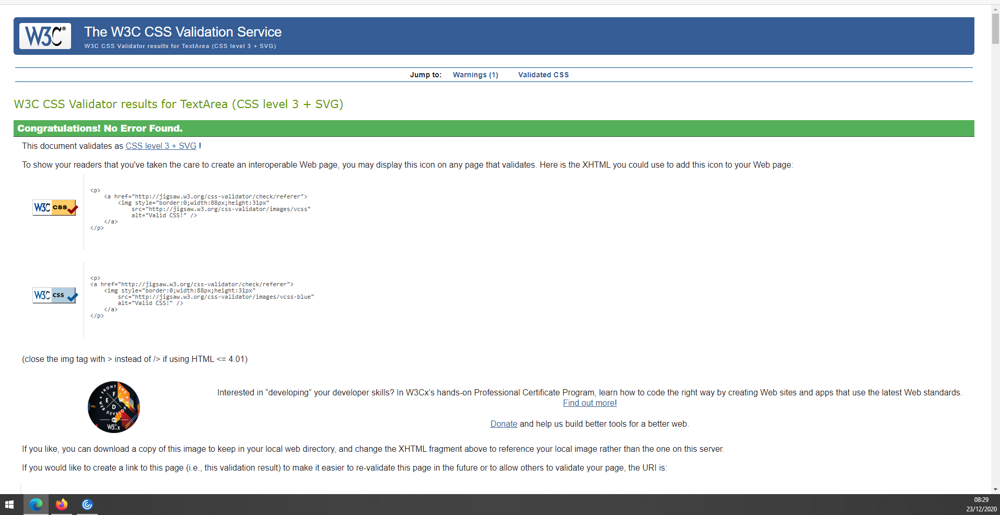

# **P&L Services Website Testing** 

The testing, which follows, has been completed on the initial version of the P&L Services Website between 20th December and 22nd December 2020.

All testing was conducted on the site published on GitHub Pages (https://andrewboyd79.github.io/P-L-Services/)

---

## **Contents**
1. **[Code Validators](#Code-validators)**
    - [W3C Markup Validation Service](#W3C-markup)
    - [W3C CSS Validation Service](#W3C-CSS)
 
2. **[User Story testing](#User-story-testing)**

3. **[Responsiveness Testing](#Responsiveness-testing)**
    - [Mobile](#Mobile)
    - [Tablet](#Tablet)

4. **[Browser Testing](#Browser-testing)**

5. **[Bugs](#Bugs)**

---

# **Code Validators**
Code validators were used on all .html and .css pages to ensure the code used, in the P-L Services website, was valid.

## [W3C Markup Validation Service](https://validator.w3.org/)

Code was validated through Direct Input by copying and pasting the html content directly in to the validator:

index.html

- No errors or warnings to show on index.html

gallery.html

- No errors or warnings to show on gallery.html

contact-us.html

- No errors to show on contact-us.html

## [W3C Markup CSS Service](https://jigsaw.w3.org/css-validator/validator.html.en)

Code was validated by Direct Input by copying and pasting directly in to the validator:

style.css

- No errors found on style.css

---
# **User story testing**

The user stories from the README.md file were used as a basis for testing.  For each test case the test acceptance criteria, evidence/observations and outcome have been recorded:

**1. "As a user I want to find out which sample bottle/type I require so that I can sample my patient correctly"**

Acceptance criteria:
- End users should be able to get information for P-L Services website on laboratory tests and which bottles they should use.  
- This information should be available on all device sizes.

Evidence/Oservations:
- Each department section (Clinical Biochemsitry, Haematology, Microbiology) on the index.html page contains clickable links to testing information.  Sample information, Expected Turnaround time and notes are detailed on each pop-out modal
- All buttons/pop out checked on desktop (MS-Edge, Chrome and Firefox).
- All buttons operate as expected on ipad/safari browser.
- All buttons operate as expected on android mobile phone (running Android 10 and MS Edge mobile version)
- Following minor issues noted:
    - Word Department missing from Clinical Biochemistry section (index.html will be amended accordingly)
    - Group/AB Screen does not open at correct size on desktop (index.html will be amended accordingly)
    - LFT Notes section related to different assay (index.html will be updated accordingly)
    - Micro Invest pop out details MRSA information (index.html will be updated accordingly)

Outcome: Test successful

---

**2. "As a user I want to have the most suitable staff member contact me about a laboratory result so that I can treat my patient properly**

Acceptance criteria:
- End users should be able to find laboratory contact information on the P-L Services website 
- This information should be available on all device sizes.

Evidence/Oservations:
- Contact information for each department is listed on the contact-us.html page.  That page also has a form which allows users to cantact the laboratory about any issues they have with samples.
- Contacts & form checked on desktop (MS-Edge, Chrome and Firefox).
- Contacts & form checked on ipad/safari browser.
- Contacts & form checked on android mobile phone (running Android 10 and MS Edge mobile version)
- Following minor issues noted:
    - Margin/spcing below words of contact card on desktop is not correct (style.css will be amended accordingly)
    - Color of telephone numbers on ipad is not correct (style.css will be amended accordingly)

Outcome: Test successful

---

**3. "As a user I want to find out what goes on behind those closed doors in the laboratory so I have confidence in the work they're doing"**

Acceptance criteria:
- End users should be able to see media, on the P-L Services website, which outlines what goes on within the laboratory 
- This information should be available on all device sizes.

Evidence/Oservations:
- The gallery page has images which show the work of the laboratory
- Gallery images and text checked on desktop (MS-Edge, Chrome and Firefox).
- Gallery images and text checked on ipad/safari browser.
- Gallery images and text checked on android mobile phone (running Android 10 and MS Edge mobile version)

Outcome: Test successful

---

**4. "As a business manager I want end users not to be calling asking about sample bottles/test so laboratory staff can concentrate on testing"**

Acceptance criteria:
- End users should have an alternative means, on the P-L Services website, to contact the laboratory 
- This alternative means should be available on all device sizes.

Evidence/Oservations:
- Contact Us form on the contact-us.html page gives users an alterntive means of contacting laboratory
- Contact Us form displays correctly on desktop (MS-Edge, Chrome and Firefox).
- Contact Us form displays correctly on ipad/safari browser.
- Contact Us form displays correctly on android mobile phone (running Android 10 and MS Edge mobile version)

Outcome: Test successful

---

**5. "As a business manager I want to showcase the laboratory in the best light so that I can get additional funding"**

Acceptance criteria:
- The P-L Services website, should display high quality content throughout 
- This information should be available on all device sizes.

Evidence/Oservations:
- The gallery page has high quality images which show the work of the laboratory
- The website itself displays responsively on all device sizes to aid with the user experience

Outcome: Test successful

---

# **Responsiveness Testing**

The website has been designed to be responsive to different screen sizes. The following has been checked on both mobile (android mobile phone running Android 10 and MS Edge mobile version) and tablet (ipad/safari browser) sized devices.

## Mobile

- Header - the navigation elements of the header section collapse under a menu button as expected. Separation markers between items (seen on larger screens) are not visible as expected. Clicking the logo returns the user to the Home page from all pages.  Clicking the Home, Gallery and Contact Us links navigate the user to the respective pages successfully
- Hero section - hero image is not displayed on mobile as expected and has been replaced with coloured background
- 3 department sections - buttons are reduced in size with smaller font sizing used; layout has been amended (2x columns of buttons side by side) with the departmental information pushed beneath the buttons filling the entire width of the screen. All buttons previously tested in User stories testing. All buttons size and align correctly
- Footer - the separation markers have been removed at this screen size as expected. Links display in 2x columns. Clicking each of the social media links opens the relevant website (Facebook, Youtube or Twitter) in new windows as expected.  The hospital link opens a new window with the P-L Services website as this is not yet linked to a larger organisation website.

## Tablet 

- Header - the navigation elements have their font size reduced as expected. Separation markers between items remain as expected. Clicking the logo returns the user to the Home page from all pages.  Clicking the Home, Gallery and Contact Us links navigate the user to the respective pages successfully
- Hero section - hero image is displayed at this screen size as expected
- 3 department sections - size of the buttons has been amended to ensure they can be clicked easily on this device size with smaller font sizing used; layout has been amended (2x columns of buttons side by side) with the departmental information pushed beneath the buttons filling the entire width of the screen. All buttons previously tested in User stories testing and size/align correctly
- Footer - Links display across the page with the font size being reduced to reflect the screen size. Clicking each of the social media links opens the relevant website (Facebook, Youtube or Twitter) in new windows as expected.  The hospital link opens a new window with the P-L Services website as this is not yet linked to a larger organisation website.

---

# **Browser testing**
The website has been tested on the following browsers:
- Firefox browser (Version 84.0 (64-bit))
- Microsoft Edge browser (Version 87.0.664.66 (Official build) (64-bit))
- Chrome Browser (Version 87.0.4280.88 (Official Build) (64-bit))
- Safari Browser
- MS Edge Mobile (Version45.11.24.5118)

---

# Bugs
The following bugs were noted during development of the P-L Services website:
- issues getting modal elements to open initially - issue due to missing javascript scripts - resolved by adding relevant javascript links/scripts
- issues getting alignment of navbar elements initially - issue involved elements not being floated/positioned correctl - resolved in style.css following review of Code Institute teaching modules/Slack
- issues over setting up Bootstrap grid to operate responsively at different screen sizes - issue was down to lack of knowledge - resolved following review of Code Institute teaching modules/Slack/Youtube videos on the topic
- issues with colouring of downloaded icon files - issued due to colour of icons being set within .svg file - resolved by amending colour setting within the .svg file following review of [Stack Overflow article](https://stackoverflow.com/questions/22252472/how-to-change-the-color-of-an-svg-element)
- issue with numbers on contact-us.html being displayed in blue on ipad - issue still being investigated 
- errors generated on testing of gallery.html relating to spaces in an image name - resolved by renaming files in GitPod and amended path within gallery.html
- errors generated on testing of style.css relating to margins being set as Margin: 20 auto - resolved by amending relevant lines in style.css to be Margin: 20px auto; 
- errors generated on testing of contact-us.html relating to use of datetime type and associated placeholder not being legal - resolved by amended type in contact-us.html
